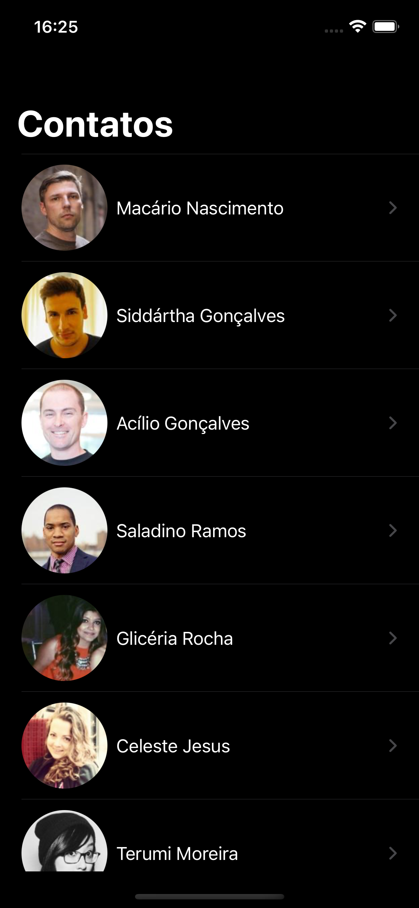
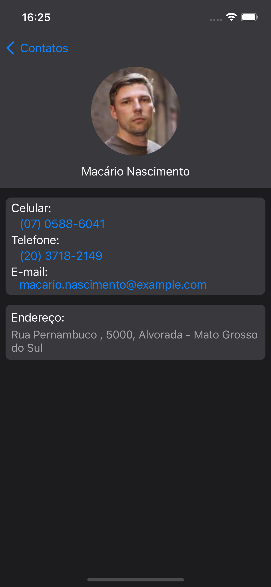

# Lista de Contatos - RXSwift, NSCache, Storyboard, RandomUser-API, Pagination

Este aplicativo exibe uma lista de contatos obtidos da [API RandomUser](https://randomuser.me). Sua criação envolveu a aplicação de diversas habilidades, como a utilização da biblioteca [RXSwift](https://github.com/ReactiveX/RxSwift) para programação reativa, a utilização da coleção NSCache para um armazenamento local otimizado de imagens, paginação dos resultados para termos o efeito de "scroll infinito" e a construção das interfaces por meio do Storyboard.

 
    
    

## Recursos

- **Exibição da lista de contatos**: O aplicativo exibe uma lista de contatos exibindo foto e nome.

- **Detalhes do Contato**: É possível visualizar detalhes sobre o contato, como número do celular, telefone, e-mail e endereço.

- **Ligar ou enviar e-mail**: Ao clicar no número de celular ou telefone, será exibido uma opção para efetuar a chamada para o número selecionado. O mesmo ocorre para o e-mail, quando clicado, será aberto o aplicativo de e-mail padrão.

## Requisitos

- iOS 13.0 ou posterior
- Xcode 12.0 ou posterior
- Conexão à internet para obter dados meteorológicos em tempo real

## Como Usar

1. Abra o aplicativo no simulador do Xcode ou em um dispositivo iOS.

2. Na tela inicial, selecione o contato para mais detalhes ou utilize o scroll para exibir mais contatos.

## Estudo aplicado

- Swift.
- Storyboard (construção interface).
- RXSwift (construção da lista de contatos utilizando reatividade).
- NSCache (cache imagem).
- URLSession (obter dados da API).
- MVVM.

## Licença

Este aplicativo é distribuído sob a licença MIT.

---
